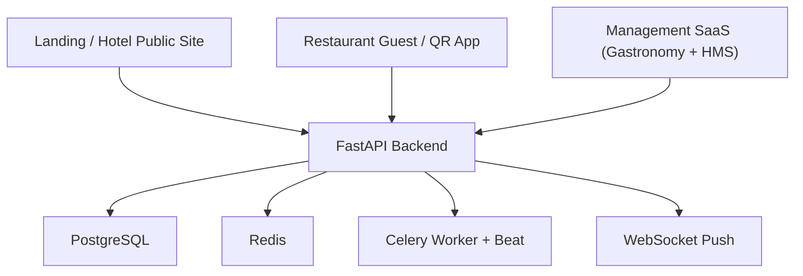

# Project Report

## 1. High-Level Architecture

The repository is a monorepo organized around one shared FastAPI backend and one shared PostgreSQL database. Multiple frontend surfaces consume that same backend:

- A public landing/hotel website
- A restaurant guest app for menu browsing and QR ordering
- A management SaaS platform that includes both gastronomy and hotel management modules

At a high level, the system is a modular monolith rather than a microservice architecture. The backend centralizes API routing, authentication, business rules, persistence, realtime updates, and background tasks.

### Backend framework

- FastAPI
- SQLAlchemy async ORM
- Alembic for schema migrations
- Redis
- Celery worker and beat
- JWT-based authentication

These are defined primarily in:

- [backend/pyproject.toml](/Users/ali/Documents/das elb/Das-Elb-landingpage/backend/pyproject.toml)
- [backend/app/main.py](/Users/ali/Documents/das elb/Das-Elb-landingpage/backend/app/main.py)
- [backend/app/database.py](/Users/ali/Documents/das elb/Das-Elb-landingpage/backend/app/database.py)
- [backend/app/config.py](/Users/ali/Documents/das elb/Das-Elb-landingpage/backend/app/config.py)

### Frontend technologies

#### Management SaaS

- Next.js 16
- React 19
- TypeScript
- Tailwind CSS
- Zustand

Defined in:

- [frontend/package.json](/Users/ali/Documents/das elb/Das-Elb-landingpage/frontend/package.json)

#### Restaurant app

- React-based frontend
- Lightweight guest-facing UI for menu and ordering

Defined in:

- [das-elb-rest/package.json](/Users/ali/Documents/das elb/Das-Elb-landingpage/das-elb-rest/package.json)

#### Landing / hotel site

- Static/built frontend served by Node
- Appears to be generated from a framework build, but the checked-in repo mainly contains compiled output

Defined in:

- [das-elb-hotel/server.js](/Users/ali/Documents/das elb/Das-Elb-landingpage/das-elb-hotel/server.js)

### Database type

- PostgreSQL 16

Confirmed in:

- [docker-compose.yml](/Users/ali/Documents/das elb/Das-Elb-landingpage/docker-compose.yml)
- [render.yaml](/Users/ali/Documents/das elb/Das-Elb-landingpage/render.yaml)

### Shared backend: benefits and limits

#### Benefits

- One source of truth for restaurant, guest, booking, room, and operational data
- Shared auth and authorization model
- Reuse of common business logic across multiple apps
- Easier consistency between public apps and internal dashboards
- Shared realtime infrastructure

#### Limits

- Strong coupling between product areas
- Schema changes affect multiple apps at once
- Uneven maturity across modules creates maintenance risk
- Restaurant and hotel domains are not equally well-structured today

## 2. Folder-by-Folder Breakdown

### `/backend`

- Purpose:
  Central API, business logic, persistence, auth, background jobs, and realtime delivery.
- Key Files:
  - [backend/app/main.py](/Users/ali/Documents/das elb/Das-Elb-landingpage/backend/app/main.py)
  - [backend/app/config.py](/Users/ali/Documents/das elb/Das-Elb-landingpage/backend/app/config.py)
  - [backend/app/database.py](/Users/ali/Documents/das elb/Das-Elb-landingpage/backend/app/database.py)
  - [backend/pyproject.toml](/Users/ali/Documents/das elb/Das-Elb-landingpage/backend/pyproject.toml)
- Responsibilities:
  - API composition
  - Domain routing
  - DB access
  - Security
  - Shared platform behavior
- Dependencies:
  - PostgreSQL
  - Redis
  - Celery
  - JWT auth

### `/backend/app`

- Purpose:
  Main application code organized by domain.
- Key Files:
  - [backend/app/main.py](/Users/ali/Documents/das elb/Das-Elb-landingpage/backend/app/main.py)
  - [backend/app/dependencies.py](/Users/ali/Documents/das elb/Das-Elb-landingpage/backend/app/dependencies.py)
- Responsibilities:
  - Domain modules for restaurant, hotel, analytics, and shared platform concerns
- Dependencies:
  - Internal domain services and SQLAlchemy models

Important subfolders:

### `/backend/app/auth`

- Purpose:
  Authentication, user management, JWT issuance, and role handling
- Key Files:
  - [backend/app/auth/models.py](/Users/ali/Documents/das elb/Das-Elb-landingpage/backend/app/auth/models.py)
  - [backend/app/auth/router.py](/Users/ali/Documents/das elb/Das-Elb-landingpage/backend/app/auth/router.py)
  - [backend/app/auth/service.py](/Users/ali/Documents/das elb/Das-Elb-landingpage/backend/app/auth/service.py)
- Responsibilities:
  - Login
  - Token generation
  - User lookup
  - Role-aware auth
- Dependencies:
  - Shared DB
  - JWT helpers

### `/backend/app/menu`

- Purpose:
  Restaurant menu administration
- Key Files:
  - [backend/app/menu/models.py](/Users/ali/Documents/das elb/Das-Elb-landingpage/backend/app/menu/models.py)
  - [backend/app/menu/service.py](/Users/ali/Documents/das elb/Das-Elb-landingpage/backend/app/menu/service.py)
- Responsibilities:
  - Categories
  - Items
  - Modifiers
  - Combos
  - Upsell logic
- Dependencies:
  - Restaurant tenant data
  - Billing and ordering flows

### `/backend/app/reservations`

- Purpose:
  Restaurant reservation and table management
- Key Files:
  - [backend/app/reservations/models.py](/Users/ali/Documents/das elb/Das-Elb-landingpage/backend/app/reservations/models.py)
  - [backend/app/reservations/service.py](/Users/ali/Documents/das elb/Das-Elb-landingpage/backend/app/reservations/service.py)
  - [backend/app/reservations/public_router.py](/Users/ali/Documents/das elb/Das-Elb-landingpage/backend/app/reservations/public_router.py)
- Responsibilities:
  - Reservations
  - Tables
  - Sections
  - Waitlist
  - QR table codes
  - Session assignment
- Dependencies:
  - Guests
  - Restaurant layout
  - Billing

### `/backend/app/billing`

- Purpose:
  Orders, payments, kitchen display, and settlement
- Key Files:
  - [backend/app/billing/models.py](/Users/ali/Documents/das elb/Das-Elb-landingpage/backend/app/billing/models.py)
  - [backend/app/billing/service.py](/Users/ali/Documents/das elb/Das-Elb-landingpage/backend/app/billing/service.py)
- Responsibilities:
  - Table orders
  - Order items
  - Bills
  - Payments
  - Cash shifts
  - KDS support
- Dependencies:
  - Menu
  - Reservations
  - Employees

### `/backend/app/qr_ordering`

- Purpose:
  Public QR ordering flows
- Key Files:
  - [backend/app/qr_ordering/router.py](/Users/ali/Documents/das elb/Das-Elb-landingpage/backend/app/qr_ordering/router.py)
  - [backend/app/qr_ordering/service.py](/Users/ali/Documents/das elb/Das-Elb-landingpage/backend/app/qr_ordering/service.py)
- Responsibilities:
  - Public table lookup
  - Public menu read
  - Guest order submission
- Dependencies:
  - Menu
  - Billing
  - Table/session state

### `/backend/app/hms`

- Purpose:
  Hotel management system domain
- Key Files:
  - [backend/app/hms/models.py](/Users/ali/Documents/das elb/Das-Elb-landingpage/backend/app/hms/models.py)
  - [backend/app/hms/router.py](/Users/ali/Documents/das elb/Das-Elb-landingpage/backend/app/hms/router.py)
  - [backend/app/hms/public_router.py](/Users/ali/Documents/das elb/Das-Elb-landingpage/backend/app/hms/public_router.py)
- Responsibilities:
  - Properties
  - Rooms
  - Room types
  - Hotel reservations
  - Front-desk stats
- Dependencies:
  - Shared DB
  - Guest profiles

### `/backend/app/dashboard`

- Purpose:
  Aggregated restaurant management metrics and views
- Key Files:
  - [backend/app/dashboard/service.py](/Users/ali/Documents/das elb/Das-Elb-landingpage/backend/app/dashboard/service.py)
- Responsibilities:
  - KPIs
  - Alerts
  - Activity summaries
- Dependencies:
  - Billing
  - Reservations
  - Inventory
  - Workforce

### `/backend/app/inventory`

- Purpose:
  Restaurant stock and purchasing
- Responsibilities:
  - Vendors
  - Inventory items
  - Purchase orders
  - Stock movements

### `/backend/app/guests`

- Purpose:
  Guest/customer data shared across flows
- Responsibilities:
  - Guest profiles
  - Guest-linked reservations and orders

### `/backend/app/workforce`

- Purpose:
  Employee-facing operational structures
- Responsibilities:
  - Staff-related entities and workflows used by restaurant operations

### `/backend/app/accounting`, `/backend/app/forecasting`, `/backend/app/marketing`, `/backend/app/franchise`, `/backend/app/vision`, `/backend/app/food_safety`, `/backend/app/digital_twin`, `/backend/app/maintenance`, `/backend/app/menu_designer`, `/backend/app/signage`, `/backend/app/vouchers`, `/backend/app/core`, `/backend/app/integrations`

- Purpose:
  Extended operational, AI, analytics, and business modules
- Responsibilities:
  - Advanced functionality around reporting, forecasting, content, integrations, and operational support
- Pattern:
  - Many of these modules are scaffolded similarly to core restaurant modules, but some are still partially implemented or stubbed

### `/backend/app/middleware`

- Purpose:
  Cross-cutting HTTP middleware
- Responsibilities:
  - Request size limits
  - Security headers
  - request/response concerns

### `/backend/app/security`

- Purpose:
  Security-related helpers
- Key Files:
  - [backend/app/security/rate_limit.py](/Users/ali/Documents/das elb/Das-Elb-landingpage/backend/app/security/rate_limit.py)
- Responsibilities:
  - Rate limiting
  - Hardening support

### `/backend/app/observability`

- Purpose:
  Metrics and monitoring hooks

### `/backend/app/shared`

- Purpose:
  Shared helpers and utilities
- Key Files:
  - [backend/app/shared/audit.py](/Users/ali/Documents/das elb/Das-Elb-landingpage/backend/app/shared/audit.py)

### `/backend/app/websockets`

- Purpose:
  Realtime event delivery to frontends
- Key Files:
  - [backend/app/websockets/router.py](/Users/ali/Documents/das elb/Das-Elb-landingpage/backend/app/websockets/router.py)
  - [backend/app/websockets/connection_manager.py](/Users/ali/Documents/das elb/Das-Elb-landingpage/backend/app/websockets/connection_manager.py)
- Responsibilities:
  - Push order/reservation/booking events to clients

### `/backend/alembic`

- Purpose:
  Migration management
- Responsibilities:
  - Schema versioning
  - Evolving shared DB structure

### `/backend/alembic/versions`

- Purpose:
  Concrete migration history
- Key Files:
  - [backend/alembic/versions/3e542e56b138_initial_schema.py](/Users/ali/Documents/das elb/Das-Elb-landingpage/backend/alembic/versions/3e542e56b138_initial_schema.py)
  - [backend/alembic/versions/9b4c1d2e7f10_phase4_add_restaurant_id_to_core_tables.py](/Users/ali/Documents/das elb/Das-Elb-landingpage/backend/alembic/versions/9b4c1d2e7f10_phase4_add_restaurant_id_to_core_tables.py)
  - [backend/alembic/versions/95069ca497e7_add_hms_models.py](/Users/ali/Documents/das elb/Das-Elb-landingpage/backend/alembic/versions/95069ca497e7_add_hms_models.py)
  - [backend/alembic/versions/8378c8dce28c_sync_reservations_and_hms_schema.py](/Users/ali/Documents/das elb/Das-Elb-landingpage/backend/alembic/versions/8378c8dce28c_sync_reservations_and_hms_schema.py)

### `/backend/scripts`

- Purpose:
  Utilities for seeding and import
- Key Files:
  - [backend/scripts/seed.py](/Users/ali/Documents/das elb/Das-Elb-landingpage/backend/scripts/seed.py)
  - [backend/scripts/import_gastronovi.py](/Users/ali/Documents/das elb/Das-Elb-landingpage/backend/scripts/import_gastronovi.py)

### `/backend/tests`

- Purpose:
  Test coverage for API behavior and tenant isolation
- Key Files:
  - [backend/tests/test_tenant_isolation_api.py](/Users/ali/Documents/das elb/Das-Elb-landingpage/backend/tests/test_tenant_isolation_api.py)
  - [backend/tests/test_reservations/test_reservation_api.py](/Users/ali/Documents/das elb/Das-Elb-landingpage/backend/tests/test_reservations/test_reservation_api.py)

### `/frontend`

- Purpose:
  Management SaaS frontend for both gastronomy and hotel operations
- Key Files:
  - [frontend/package.json](/Users/ali/Documents/das elb/Das-Elb-landingpage/frontend/package.json)
  - [frontend/next.config.ts](/Users/ali/Documents/das elb/Das-Elb-landingpage/frontend/next.config.ts)
  - [frontend/src/lib/api.ts](/Users/ali/Documents/das elb/Das-Elb-landingpage/frontend/src/lib/api.ts)
- Responsibilities:
  - Authenticated dashboard UI
  - Restaurant management
  - Hotel management
  - Realtime operational screens
- Dependencies:
  - Shared backend

### `/frontend/src/app`

- Purpose:
  Next.js route tree
- Responsibilities:
  - `(dashboard)` contains restaurant-facing SaaS pages
  - `(management)` contains hotel/HMS pages

### `/frontend/src/components`

- Purpose:
  Shared UI shell and reusable UI pieces
- Key Files:
  - [frontend/src/components/layout/sidebar.tsx](/Users/ali/Documents/das elb/Das-Elb-landingpage/frontend/src/components/layout/sidebar.tsx)
  - [frontend/src/components/layout/header.tsx](/Users/ali/Documents/das elb/Das-Elb-landingpage/frontend/src/components/layout/header.tsx)

### `/frontend/src/lib`

- Purpose:
  API, auth, routing, and websocket utilities
- Key Files:
  - [frontend/src/lib/api.ts](/Users/ali/Documents/das elb/Das-Elb-landingpage/frontend/src/lib/api.ts)
  - [frontend/src/lib/auth.ts](/Users/ali/Documents/das elb/Das-Elb-landingpage/frontend/src/lib/auth.ts)
  - [frontend/src/lib/websocket.ts](/Users/ali/Documents/das elb/Das-Elb-landingpage/frontend/src/lib/websocket.ts)
  - [frontend/src/lib/role-routing.ts](/Users/ali/Documents/das elb/Das-Elb-landingpage/frontend/src/lib/role-routing.ts)

### `/frontend/src/stores`

- Purpose:
  Frontend state containers
- Key Files:
  - [frontend/src/stores/auth-store.ts](/Users/ali/Documents/das elb/Das-Elb-landingpage/frontend/src/stores/auth-store.ts)

### `/frontend/src-tauri`

- Purpose:
  Desktop packaging support for the SaaS frontend

### `/das-elb-rest`

- Purpose:
  Restaurant guest app
- Key Files:
  - [das-elb-rest/src/App.jsx](/Users/ali/Documents/das elb/Das-Elb-landingpage/das-elb-rest/src/App.jsx)
  - [das-elb-rest/src/lib/api.js](/Users/ali/Documents/das elb/Das-Elb-landingpage/das-elb-rest/src/lib/api.js)
- Responsibilities:
  - Menu browsing
  - QR table resolution
  - Guest ordering
- Dependencies:
  - Public restaurant API endpoints

### `/das-elb-hotel`

- Purpose:
  Public landing/hotel frontend deployment artifact
- Key Files:
  - [das-elb-hotel/server.js](/Users/ali/Documents/das elb/Das-Elb-landingpage/das-elb-hotel/server.js)
  - [das-elb-hotel/public/index.html](/Users/ali/Documents/das elb/Das-Elb-landingpage/das-elb-hotel/public/index.html)
- Responsibilities:
  - Serve public website
  - Submit public form data to backend

### `/data`

- Purpose:
  Shared/importable data assets
- Key Files:
  - [data/gastronovi_raw_items.json](/Users/ali/Documents/das elb/Das-Elb-landingpage/data/gastronovi_raw_items.json)

### `/docs`

- Purpose:
  Documentation and external API contracts
- Key Files:
  - [docs/voicebooker_openapi.yaml](/Users/ali/Documents/das elb/Das-Elb-landingpage/docs/voicebooker_openapi.yaml)

### `/infrastructure`

- Purpose:
  Ops and monitoring support
- Key Files:
  - [infrastructure/monitoring/prometheus-alerts.yml](/Users/ali/Documents/das elb/Das-Elb-landingpage/infrastructure/monitoring/prometheus-alerts.yml)
  - [infrastructure/scripts/load_test_ws.py](/Users/ali/Documents/das elb/Das-Elb-landingpage/infrastructure/scripts/load_test_ws.py)

### `/management`

- Purpose:
  Placeholder directory
- Note:
  The real management SaaS implementation is currently in [frontend](/Users/ali/Documents/das elb/Das-Elb-landingpage/frontend), not here.

### `/attached_assets`

- Purpose:
  Auxiliary asset storage; not a core runtime module

## 3. Backend Analysis

### API style

- REST API
- JSON payloads
- WebSocket support for realtime updates
- No GraphQL layer found

### Routing system

Routers are composed in:

- [backend/app/main.py](/Users/ali/Documents/das elb/Das-Elb-landingpage/backend/app/main.py)

Important route groups include:

- `/api/auth`
- `/api/menu`
- `/api/reservations`
- `/api/billing`
- `/api/dashboard`
- `/api/inventory`
- `/api/hms`
- `/api/public/hotel`
- `/api/public/restaurant`
- `/api`
- `/ws`

### Controllers, services, and models

The backend follows a domain-module structure:

- `router.py` exposes HTTP endpoints
- `service.py` holds business logic
- `models.py` defines ORM entities
- `schemas.py` defines request/response contracts where present

This is closest to a service-layered modular monolith.

### Restaurant support in the backend

#### Orders and billing

Handled mainly in:

- [backend/app/billing/models.py](/Users/ali/Documents/das elb/Das-Elb-landingpage/backend/app/billing/models.py)
- [backend/app/billing/service.py](/Users/ali/Documents/das elb/Das-Elb-landingpage/backend/app/billing/service.py)

Supports:

- Table orders
- Order items
- Bills
- Payments
- Kitchen display logic
- Cash shift workflows

#### Menus

Handled in:

- [backend/app/menu/models.py](/Users/ali/Documents/das elb/Das-Elb-landingpage/backend/app/menu/models.py)
- [backend/app/menu/service.py](/Users/ali/Documents/das elb/Das-Elb-landingpage/backend/app/menu/service.py)

Supports:

- Categories
- Menu items
- Modifiers
- Combos
- Upsells

#### Reservations

Handled in:

- [backend/app/reservations/models.py](/Users/ali/Documents/das elb/Das-Elb-landingpage/backend/app/reservations/models.py)
- [backend/app/reservations/service.py](/Users/ali/Documents/das elb/Das-Elb-landingpage/backend/app/reservations/service.py)

Supports:

- Table reservations
- Waitlist
- Section and table assignment
- Table sessions
- Public reservation entry points

### Hotel support in the backend

Handled in:

- [backend/app/hms/models.py](/Users/ali/Documents/das elb/Das-Elb-landingpage/backend/app/hms/models.py)
- [backend/app/hms/router.py](/Users/ali/Documents/das elb/Das-Elb-landingpage/backend/app/hms/router.py)
- [backend/app/hms/public_router.py](/Users/ali/Documents/das elb/Das-Elb-landingpage/backend/app/hms/public_router.py)

Supports:

- Hotel properties
- Room types
- Rooms
- Hotel reservations
- Front desk arrival/departure views

### Authentication and authorization

Handled in:

- [backend/app/dependencies.py](/Users/ali/Documents/das elb/Das-Elb-landingpage/backend/app/dependencies.py)
- [backend/app/auth/models.py](/Users/ali/Documents/das elb/Das-Elb-landingpage/backend/app/auth/models.py)

Observed model:

- JWT bearer authentication
- User roles: `admin`, `manager`, `staff`
- Restaurant-oriented tenant scoping via `restaurant_id`
- Role guards for protected endpoints

### Multi-domain logic in one backend

The backend combines restaurant and hotel logic by:

- Keeping separate domain modules
- Reusing the same infrastructure and persistence layer
- Sharing guest/auth/platform components
- Exposing separate route groups for public and admin use cases

This is efficient, but it also means changes in one domain can impact the others if contracts are not tightly managed.

## 4. Database Design

### Database type

- SQL database
- Specifically PostgreSQL

### Main entities

#### Core and auth

- `restaurants`
- `users`
- `employees`

#### Guest and CRM-oriented

- `guest_profiles`

#### Restaurant menu and operations

- `menu_categories`
- `menu_items`
- modifier and combo tables
- `floor_sections`
- `tables`
- `reservations`
- `waitlist_entries`
- `qr_table_codes`
- `table_sessions`
- `table_orders`
- `order_items`
- `bills`
- `payments`

#### Inventory and procurement

- `vendors`
- `inventory_items`
- `purchase_orders`
- `inventory_movements`

#### Hotel management

- `hms_properties`
- `hms_room_types`
- `hms_rooms`
- `hms_reservations`

### Relationships

- `users.restaurant_id -> restaurants.id`
- Menu categories and menu items are tied to a restaurant
- Reservations can link to guests and tables
- Orders link to tables, sessions, menu items, and servers
- Bills and payments are downstream of orders
- Rooms link to room types and hotel properties
- Hotel reservations link to properties and can link to guest profiles

### Shared data safety and consistency

Restaurant-side consistency is stronger than hotel-side consistency because:

- Restaurant domain tables are more consistently tenant-scoped
- Tenant isolation is tested in [backend/tests/test_tenant_isolation_api.py](/Users/ali/Documents/das elb/Das-Elb-landingpage/backend/tests/test_tenant_isolation_api.py)
- Shared service-layer patterns are well-established there

Hotel-side consistency exists conceptually, but current code shows some drift between routers, models, and frontend expectations.

## 5. Frontend Applications

### Landing Page

#### Purpose and functionality

- Public-facing marketing and inquiry surface
- Reads and submits shared hospitality data through backend endpoints

#### Backend interaction

The verified public flows submit to endpoints such as:

- `/api/reservations/`
- `/api/event-bookings/`
- `/api/tagungen/`

These are handled by:

- [backend/app/landing_adapter.py](/Users/ali/Documents/das elb/Das-Elb-landingpage/backend/app/landing_adapter.py)

#### Key components/pages

The source page/component structure is not available in clean source form inside the repository, because [das-elb-hotel](/Users/ali/Documents/das elb/Das-Elb-landingpage/das-elb-hotel) mainly contains built assets.

### Restaurant App

#### Purpose and functionality

- Public restaurant experience for guests
- Core features:
  - Menu browsing
  - Table lookup by QR code
  - Cart building
  - Order submission

#### Backend interaction

Uses:

- `/api/public/restaurant/menu`
- `/api/public/restaurant/table/{code}`
- `/api/public/restaurant/order`

Implemented through:

- [das-elb-rest/src/lib/api.js](/Users/ali/Documents/das elb/Das-Elb-landingpage/das-elb-rest/src/lib/api.js)

#### State management

- Primarily local React state
- No heavy shared state system was evident in the checked-in code

### Management SaaS

#### Purpose and functionality

- Internal admin and operational platform
- Covers both:
  - Gastronomy management
  - Hotel/HMS management

#### How it manages both domains

The frontend separates the domains by route groups:

- Restaurant SaaS under `(dashboard)`
- Hotel/HMS under `(management)`

This is visible in:

- [frontend/src/app/(dashboard)/layout.tsx](/Users/ali/Documents/das elb/Das-Elb-landingpage/frontend/src/app/(dashboard)/layout.tsx)
- [frontend/src/app/(management)/layout.tsx](/Users/ali/Documents/das elb/Das-Elb-landingpage/frontend/src/app/(management)/layout.tsx)

#### Role-based access

Supported via auth store and route logic in:

- [frontend/src/stores/auth-store.ts](/Users/ali/Documents/das elb/Das-Elb-landingpage/frontend/src/stores/auth-store.ts)
- [frontend/src/lib/auth.ts](/Users/ali/Documents/das elb/Das-Elb-landingpage/frontend/src/lib/auth.ts)
- [frontend/src/lib/role-routing.ts](/Users/ali/Documents/das elb/Das-Elb-landingpage/frontend/src/lib/role-routing.ts)

#### Observed maturity

- Restaurant management pages are significantly more connected to live backend data
- HMS pages include real integrations in some places, but many pages still rely on fallback/mock data

## 6. Integration and Data Flow

### Backend ↔ Database

Typical flow:

1. A frontend calls a backend route
2. FastAPI router validates input and auth
3. Service layer applies business rules
4. SQLAlchemy reads/writes PostgreSQL
5. Optional websocket event is emitted for live UIs

### Backend ↔ Frontends

- Public apps use public REST endpoints
- SaaS frontend uses authenticated REST endpoints
- Realtime views subscribe through websockets

### Example: creating an order

1. Guest opens the restaurant app
2. App resolves table via QR code
3. App fetches current public menu
4. Guest submits cart
5. Backend creates order and order items
6. KDS/order dashboards receive websocket updates

### Example: booking a room

1. Public hotel flow or HMS flow submits reservation data
2. Backend creates a hotel reservation record
3. Front desk and HMS reservation views can reflect the new booking
4. Websocket event can notify connected clients

Important note:

- The intended architecture is clear, but [backend/app/hms/public_router.py](/Users/ali/Documents/das elb/Das-Elb-landingpage/backend/app/hms/public_router.py) appears out of sync with [backend/app/hms/models.py](/Users/ali/Documents/das elb/Das-Elb-landingpage/backend/app/hms/models.py), so this flow may currently be fragile.

### Example: updating menu or room availability

1. Management SaaS updates data via admin endpoints
2. Backend writes to shared DB
3. Public or internal clients read updated data from the same backend

### Shared endpoints across apps

- Shared restaurant menu/order/reservation data powers both public and admin experiences
- Shared hotel reservation/room data is intended to power both public and management flows
- Landing adapter routes allow older or public-facing forms to still write into the same backend

## 7. Key Design Decisions

### Benefits of a single backend for multiple apps

- Centralized business rules
- Reusable auth and data access patterns
- Shared guest and reservation concepts
- Easier consistency between public and internal experiences
- Reduced duplication across products

### Trade-offs

- Tighter coupling between domains
- Harder to evolve one domain independently
- More complex testing and release coordination
- Schema drift becomes dangerous because several apps depend on the same contracts

### Reusability of logic across domains

The system reuses:

- Auth
- DB access patterns
- Shared guest identity
- Shared observability and websocket infrastructure
- Shared deployment/runtime stack

This reuse is one of the strongest parts of the architecture.

## 8. Potential Improvements

### Architecture

- Formalize domain boundaries inside the monolith
- Generate typed API clients from backend contracts for all frontends
- Reduce drift between public routes, HMS routes, and frontend expectations

### Scalability

- Separate clearly production-ready modules from experimental/stubbed modules
- Consider extracting especially heavy or volatile domains later only if operational pressure justifies it
- Improve async/background processing boundaries where long-running work exists

### Security

- Tighten hotel/property scoping to match restaurant tenant isolation
- Add more integration tests around authz and public booking paths
- Review public-facing endpoints and hardcoded environment assumptions

### Code organization

- Store the actual source of the hotel/landing frontend instead of only built assets
- Consolidate duplicated public booking logic
- Keep shared DTOs/contracts in one place
- Expand tests for HMS and landing adapter flows

### Best-practice recommendations

- Enforce contract-first API development
- Add end-to-end tests for cross-app shared flows
- Add schema compatibility checks for critical domain modules
- Standardize frontend data fetching and typing across all apps

## 9. Summary

This codebase is a unified hospitality platform built around one FastAPI backend and one PostgreSQL database. It serves a public landing/hotel surface, a restaurant guest ordering app, and a management SaaS covering restaurant and hotel operations.

The architecture is strongest where restaurant operations are concerned: reservations, menu management, ordering, billing, and tenant-aware SaaS workflows are all relatively coherent. The hotel side is present and integrated into the same backend/database model, but it is less mature and shows signs of contract drift and fallback-heavy frontend behavior.

Overall strengths:

- Strong centralization of business logic
- Shared operational data model
- Good reuse across frontends
- Realtime support
- Solid restaurant-domain structure

Overall weaknesses:

- Uneven maturity across domains
- HMS model/router/frontend drift
- Compiled public hotel frontend instead of maintainable source
- Coupling risk from the shared backend and DB model

In short, the architecture is suitable for a unified hospitality suite, and the monolithic shared-backend approach makes sense for the product shape. The next step should be hardening the hotel side and tightening contract consistency so the multi-app ecosystem can scale safely.
