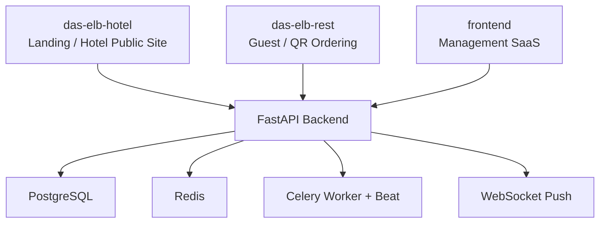
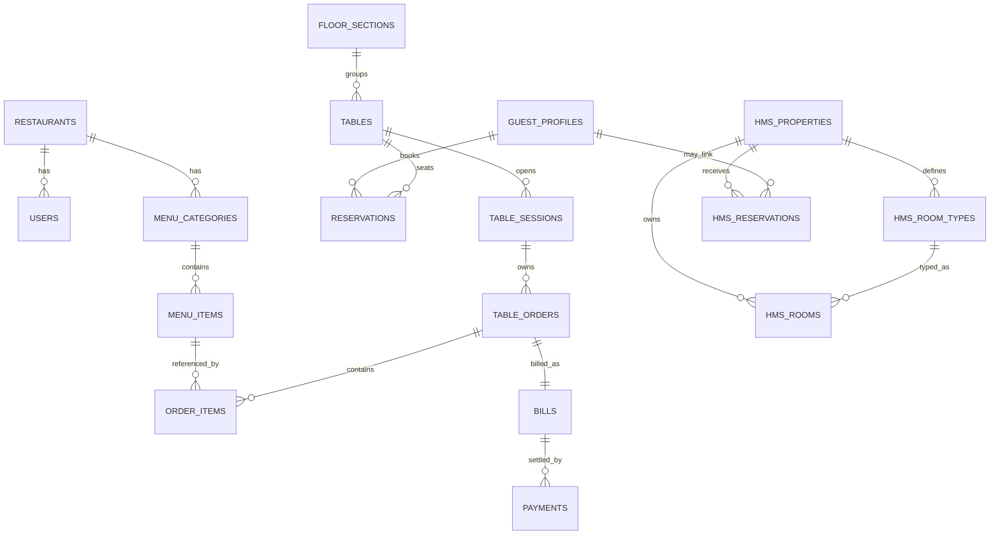

# Architecture Audit

## Production Decision

This system will be brought to production in phases.

Phase 1 (initial release):

- Backend (restaurant flows only)
- Management SaaS (restaurant features)
- Guest app (ordering via `das-elb-rest`)

Phase 2:

- Landing page rebuild (`das-elb-hotel`)
- Hotel (HMS) features stabilization

Phase 3:

- Native mobile apps (iOS/Android)
- Advanced analytics and integrations

Hotel/HMS features are **not** considered production-ready in Phase 1 unless explicitly verified.

## Scope

This audit covers the checked-in repository at `Das-Elb-landingpage` as inspected on 2026-03-24.

It includes:

- every top-level app and major folder
- backend module map
- frontend app map
- public and internal endpoint surface
- database entities and key relationships
- production environment variables and secret expectations
- test coverage gaps
- security gaps
- deployment and operational gaps
- a prioritized production-readiness backlog

This is a repository audit, not a live-environment audit. Findings are based on code, config, docs, and deployment files checked into the repo.

## Executive Summary

This repository is a unified hospitality monorepo built around one shared FastAPI backend and one shared PostgreSQL database. The intended platform model is sound: hotel, restaurant, guest-facing flows, and the management SaaS all share backend contracts and data. The strongest end-to-end implementation is the restaurant domain. The weakest areas are the hotel/public booking paths, deploy-target consistency, and production hardening of public/realtime surfaces.

Top findings:

- `backend/` is a modular FastAPI monolith with good restaurant-domain depth and partial hotel/HMS support.
- `frontend/` is the real management SaaS. `management/` is currently a placeholder.
- `das-elb-hotel/` is mostly checked-in built output, not maintainable source.
- `das-elb-rest/` contains conflicting guest-app implementations and an inconsistent build path.
- Critical public and realtime surfaces still have production-readiness gaps: websocket auth, public endpoint rate limiting, hardcoded tenant defaults, and HMS contract drift.
- Deployment configuration is inconsistent across Render, Docker, Makefile, frontend scripts, and public app packaging.

## System Topology

## Root Repository Map

| Path | Role | Notes |
| --- | --- | --- |
| `backend/` | Shared API and business logic | FastAPI, async SQLAlchemy, Alembic, JWT auth, Redis, Celery, WebSockets |
| `frontend/` | Management SaaS | Next.js 16 + React 19 + TypeScript; contains restaurant and HMS admin surfaces |
| `das-elb-hotel/` | Public landing/hotel site | Mostly compiled artifact with custom static server; source-first maintenance is weak |
| `das-elb-rest/` | Guest restaurant app | Public ordering/menu surface; build story is inconsistent |
| `data/` | Shared raw import data | Contains `gastronovi_raw_items.json` |
| `docs/` | Documentation and API contracts | Currently sparse; includes `voicebooker_openapi.yaml` |
| `infrastructure/` | Monitoring and ops scripts | Prometheus alerts and websocket load-test script |
| `management/` | Placeholder | No live application code detected |
| `attached_assets/` | Ancillary assets and prompt artifacts | Not part of runtime architecture |
| `.codex/`, `.claude/` | Tooling config | Local agent/editor instructions |
| `render.yaml` | Primary cloud deployment blueprint | Defines backend + 3 web deploy targets + DB + Redis |
| `docker-compose.yml` | Local dev orchestration | Only launches DB, Redis, backend, Celery, and `frontend/` |
| `docker-compose.prod.yml` | Production-like local compose | Missing some deploy targets present in Render |
| `Makefile` | Common dev/test commands | Focused on backend + `frontend/`; does not cover hotel/rest apps |

## Deploy Targets

| Target | Path | Runtime model | Primary audience | Current state |
| --- | --- | --- | --- | --- |
| Shared API | `backend/` | FastAPI app + Redis + PostgreSQL + Celery | All apps | Core of the platform |
| Management SaaS | `frontend/` | Next.js app, intended for static/container deploy | Internal staff and managers | Real admin app, but build/deploy scripts drift |
| Landing / Hotel site | `das-elb-hotel/` | Static site served via custom Node server or copied to `out/` | Public guests | Deployable, but source-poor and artifact-heavy |
| Guest restaurant app | `das-elb-rest/` | Static/React hybrid packaging | Public guests | Weakest deploy target; conflicting implementations |

## Folder-by-Folder Audit

### `backend/`

- Purpose: shared API, business logic, auth, persistence, background jobs, realtime.
- Key files:
  - `backend/app/main.py`
  - `backend/app/config.py`
  - `backend/app/database.py`
  - `backend/pyproject.toml`
- Patterns:
  - modular monolith
  - service-layer organization by domain
  - REST + WebSockets
- Responsibilities:
  - restaurant operations
  - hotel operations
  - public guest flows
  - integrations
  - auth and tenant scoping

### `backend/app/`

- Purpose: domain modules and platform infrastructure.
- Pattern:
  - most business modules follow `models.py`, `router.py`, `service.py`, and sometimes `schemas.py`
- Infra modules:
  - `middleware`
  - `security`
  - `observability`
  - `shared`
  - `websockets`

### `backend/alembic/`

- Purpose: migration history for the shared database.
- Important observations:
  - tenant columns were added broadly during Phase 4/5
  - later migration syncs relaxed some tenant constraints and dropped indexes

### `backend/tests/`

- Purpose: backend automated validation.
- Strength:
  - tenant isolation, auth, reservations, inventory, vouchers, integrations, and some core/dashboard flows
- Weakness:
  - no direct tests for many public flows and many modules

### `frontend/`

- Purpose: actual management SaaS for gastronomy and hotel operations.
- Major subareas:
  - `src/app/(dashboard)` for restaurant/admin workflows
  - `src/app/(management)/hms` for hotel/HMS workflows
  - `src/lib` for shared API/auth/websocket utilities
  - `src/components` for shared shell/UI
  - `src-tauri` for optional desktop packaging
- Key gap:
  - runtime/build scripts and Docker story are inconsistent

### `das-elb-hotel/`

- Purpose: public landing/hotel experience.
- Contents:
  - `server.js` static server
  - `public/` with built pages and assets
  - `_next/static` compiled bundle output
- Key gap:
  - this is mostly artifact, not source

### `das-elb-rest/`

- Purpose: guest-facing ordering/menu app.
- Contents:
  - `src/` React code
  - `public/` static app content
- Key gap:
  - the checked-in build script copies `public/*` to `dist/`, so the React source in `src/` does not appear to be the deployed artifact

### `data/`

- Purpose: import/reference data for menu/catalog seeding.

### `docs/`

- Purpose: human documentation and contract files.
- Current state:
  - thin compared with codebase size
  - contains `voicebooker_openapi.yaml`

### `infrastructure/`

- Purpose: ops support.
- Contents:
  - Prometheus alert rules
  - websocket load-test script
- Gap:
  - load-test defaults do not match the actual websocket endpoint shape

### `management/`

- Purpose: placeholder only.
- Current status:
  - not a live deploy target in code

## Backend Module Map

### Core Restaurant and Shared Modules

| Module | Purpose | Main routes | Notes |
| --- | --- | --- | --- |
| `auth` | users, restaurants, JWT auth | `/api/auth/*` | central auth boundary |
| `menu` | categories, items, modifiers, combos, upsells | `/api/menu/*` | one of the stronger restaurant modules |
| `reservations` | tables, sections, reservations, waitlist, sessions | `/api/reservations/*` | strong domain depth |
| `qr_ordering` | QR code, public menu/table lookup, guest ordering | `/api/qr/*` | overlaps with `/api/public/restaurant/*` |
| `billing` | orders, items, bills, payments, KDS, receipt | `/api/billing/*` | core restaurant operations |
| `guests` | guest profiles, loyalty, promotions, guest-linked orders | `/api/guests/*` | shared customer identity on restaurant side |
| `inventory` | stock, vendors, purchase orders, catalog, auto-purchase | `/api/inventory/*` | tested better than many other admin modules |
| `workforce` | schedules, employees, hiring, training | `/api/workforce/*` | partially implemented |
| `dashboard` | KPIs, alerts, activity, SLO dashboard | `/api/dashboard/*` | includes stubbed NL/AI responses |
| `hms` | hotel properties, rooms, room types, reservations | `/api/hms/*`, `/api/public/hotel/*` | materially less mature than restaurant side |

### Extended Operations / Analytics Modules

| Module | Purpose | Notes |
| --- | --- | --- |
| `accounting` | GL, invoices, budgets, reports | internal/admin |
| `core` | agent configs, approvals, service autopilot, revenue control | specialized operational intelligence |
| `digital_twin` | scenario simulation | scaffolded |
| `food_safety` | HACCP, temps, allergens, compliance | partially stubbed |
| `forecasting` | sales and labor forecasts | lightweight API surface |
| `franchise` | locations, benchmarks, rankings | internal |
| `integrations` | webhooks, VoiceBooker, MCP server | high-risk integration surface |
| `maintenance` | equipment, tickets, energy | partially stubbed |
| `marketing` | reviews, campaigns, social | partially stubbed |
| `menu_designer` | templates, designs, publish flow | internal/admin |
| `signage` | screens, content, playlists, public display endpoint | internal + public display |
| `vision` | waste, alerts, compliance events | internal and analytics-like |
| `vouchers` | vouchers, gift cards, customer cards, redemptions | tested better than many non-core modules |

### Platform / Infrastructure Modules

| Module | Purpose |
| --- | --- |
| `middleware` | request-id and HTTP middleware |
| `security` | rate limiting and defensive helpers |
| `observability` | metrics and alerting hooks |
| `shared` | shared helpers, audit, Celery |
| `websockets` | realtime connection management and broadcasting |

## Frontend App Map

### `frontend/` Management SaaS

| Area | Path | Purpose | Backend dependency |
| --- | --- | --- | --- |
| Auth | `frontend/src/app/(auth)` | login, register | `/api/auth/*` |
| Restaurant SaaS | `frontend/src/app/(dashboard)` | dashboard, reservations, menu, billing, orders, inventory, workforce, signage, marketing, accounting | `/api/dashboard/*`, `/api/menu/*`, `/api/reservations/*`, `/api/billing/*`, `/api/inventory/*`, others |
| Hotel SaaS | `frontend/src/app/(management)/hms` | dashboard, front desk, reservations, CRM, channels, housekeeping, rates, security, settings | `/api/hms/*` |
| Public utility pages | `frontend/src/app/order`, `frontend/src/app/receipt`, `frontend/src/app/display`, `frontend/src/app/kds` | QR/mobile ordering, public receipt, signage display, KDS | `/api/qr/*`, `/api/billing/receipt/*`, `/api/signage/display/*`, `/api/billing/kds/*` |
| Shared shell/state | `frontend/src/components`, `frontend/src/lib`, `frontend/src/stores` | API client, auth, websocket, layout | cross-cutting |

Important observations:

- `frontend/` is the real admin application.
- It mixes internal SaaS screens with a few public utility routes.
- Many HMS pages use fallback datasets even when API calls exist.

### `das-elb-hotel/`

| Area | Path | Purpose |
| --- | --- | --- |
| Static server | `das-elb-hotel/server.js` | serves static files with cache/compression behavior |
| Public pages | `das-elb-hotel/public/index.html`, `tagungen.html`, `impressum.html` | public hotel/landing content |
| Compiled assets | `das-elb-hotel/public/_next/static/*` | built JS/CSS bundles |

Important observations:

- The repo contains patched built output, not maintainable source.
- Public form flows call the shared backend directly, including production URLs inside compiled JS.

### `das-elb-rest/`

| Area | Path | Purpose |
| --- | --- | --- |
| React app | `das-elb-rest/src/*` | menu, cart, ordering UI |
| Static app | `das-elb-rest/public/*` | alternate deployable artifact |
| API client | `das-elb-rest/src/lib/api.js` | calls public restaurant endpoints |

Important observations:

- There are effectively two guest-app implementations in one folder.
- The package build script only copies `public/*`, so the source in `src/` is not clearly part of the production artifact.

## Public Endpoint Surface

### Public and Unauthenticated Endpoints

| Prefix / endpoint | Purpose | Notes |
| --- | --- | --- |
| `/health` | liveness | no DB check |
| `/api/health` | API + DB health | used by health checks |
| `/api/auth/register`, `/login`, `/refresh` | auth entry points | `/me` is authenticated |
| `/api/qr/*` | QR table lookup, public menu, order submission, order status | restaurant guest flow |
| `/api/public/restaurant/*` | stable public restaurant aliases | reserve, menu, table, order |
| `/api/public/hotel/*` | hotel public booking/read endpoints | contract drift exists here |
| `/api/reservations/`, `/api/event-bookings/`, `/api/tagungen/` | landing-page adapter endpoints | currently write into shared backend |
| `/api/billing/receipt/{token}` | public digital receipt | token-based access |
| `/webhooks/voicebooker` | external integration webhook | note missing `/api` prefix |
| `/api/webhooks/stripe/webhook` | Stripe webhook placeholder | not production-ready |
| `/mcp/voicebooker/*` | MCP server transport | sensitive integration surface |
| `/ws/{restaurant_id}` | realtime socket | currently unauthenticated at backend |

### Internal and Authenticated Endpoint Groups

| Prefix | Access model | Purpose |
| --- | --- | --- |
| `/api/agents` | manager/admin | agent config, approvals, autopilot/revenue control |
| `/api/accounting` | manager/admin | accounting |
| `/api/inventory` | manager/admin | stock and procurement |
| `/api/workforce` | manager/admin | staffing |
| `/api/franchise` | manager/admin | multi-location analytics |
| `/api/billing` | manager/admin for most routes | orders, bills, payments, KDS |
| `/api/menu-designer` | manager/admin | menu publishing |
| `/api/signage` | manager/admin | digital signage |
| `/api/vision` | tenant-authenticated | vision analytics |
| `/api/forecast` | tenant-authenticated | forecasting |
| `/api/guests` | tenant-authenticated | guest profiles and guest-linked ops |
| `/api/dashboard` | tenant-authenticated | KPIs, alerts, SLO |
| `/api/maintenance` | tenant-authenticated | maintenance |
| `/api/simulation` | tenant-authenticated | digital twin |
| `/api/safety` | tenant-authenticated | food safety |
| `/api/marketing` | tenant-authenticated | campaigns and reviews |
| `/api/menu` | tenant-authenticated | menu admin |
| `/api/reservations` | tenant-authenticated | restaurant reservations and tables |
| `/api/vouchers` | tenant-authenticated | vouchers/gift cards/cards |
| `/api/hms` | tenant-authenticated | hotel management |
| `/api/metrics` | admin-only | observability and queue lag |

## Database Entities and Relationships

### Domain Map

| Domain | Key entities | Key relationships |
| --- | --- | --- |
| Shared auth | `restaurants`, `users` | `users.restaurant_id -> restaurants.id` |
| Shared guest identity | `guest_profiles` | reused by restaurant and hotel contexts |
| Restaurant menu | `menu_categories`, `menu_items`, `menu_modifiers`, `menu_item_modifiers`, `menu_combos`, `upsell_rules` | items belong to categories; modifiers and upsells connect menu items |
| Restaurant floor/reservations | `floor_sections`, `tables`, `reservations`, `waitlist`, `qr_table_codes`, `table_sessions` | tables belong to sections; reservations link guests and optional tables; QR codes link to tables; sessions link tables and reservations |
| Restaurant billing | `table_orders`, `order_items`, `bills`, `payments`, `cash_shifts`, `kds_station_configs` | orders link tables/sessions/servers; items link orders and menu items; bills link orders; payments link bills |
| Restaurant guests/CRM | `orders`, `loyalty_accounts`, `promotions` | guest-linked restaurant history and engagement |
| Inventory | `vendors`, `inventory_items`, `purchase_orders`, `inventory_movements`, `tva_reports`, `supplier_catalog_items`, `auto_purchase_rules` | vendor and item-centric procurement graph |
| Hotel | `hms_properties`, `hms_room_types`, `hms_rooms`, `hms_reservations` | room types and rooms belong to properties; hotel reservations belong to properties and may link to guests |
| Other ops modules | accounting, forecasting, dashboard, maintenance, food safety, signage, marketing, franchise, core agent tables | mostly adjunct operational data |

### Simplified ER View

### Data-Model Observations

- Restaurant tenancy is centered on `restaurant_id` across many tables and enforced strongly at the application layer.
- Hotel logic shares the same database but is less rigorously tenant/property scoped.
- `guest_profiles` is the main shared cross-domain entity between restaurant and hotel.
- Migration history suggests tenant hardening was attempted broadly, then partially loosened later.

## Environment Variables and Secrets

### Backend Production Variables

| Variable | Needed | Purpose | Notes |
| --- | --- | --- | --- |
| `DATABASE_URL` | required | async DB connection | adapted in `backend/app/config.py` |
| `DATABASE_URL_SYNC` | recommended | sync DB connection for migrations/admin tooling | derived when possible |
| `REDIS_URL` | required | cache and general Redis connectivity | distinct from Celery DBs in `.env.example` |
| `SECRET_KEY` | required | JWT signing | production must not use default |
| `APP_ENV` | required | env mode | production changes tenant behavior and HSTS |
| `DEBUG` | recommended | debug mode | should be false in production |
| `BACKEND_URL` | recommended | backend self/base URL | used by frontend rewrites and docs |
| `FRONTEND_URL` | recommended | frontend base URL | operational/CORS alignment |
| `CORS_ORIGINS` | required | allowed origins | must include all public/admin apps |
| `ACCESS_TOKEN_EXPIRE_MINUTES` | recommended | auth TTL | security tuning |
| `REFRESH_TOKEN_EXPIRE_DAYS` | recommended | auth TTL | security tuning |
| `MAX_REQUEST_SIZE_BYTES` | recommended | request guardrail | security hardening |
| `AUTH_RATE_LIMIT_PER_MINUTE` | recommended | auth throttle | security hardening |
| `PUBLIC_RATE_LIMIT_PER_MINUTE` | recommended | public throttle | security hardening |
| `CELERY_BROKER_URL` | required if Celery is used | worker broker | shared runtime dependency |
| `CELERY_RESULT_BACKEND` | required if Celery is used | Celery result backend | shared runtime dependency |

### Feature-Dependent Backend Secrets

| Variable | Purpose | Current gap |
| --- | --- | --- |
| `VOICEBOOKER_SECRET` | webhook verification / VoiceBooker integration | not wired in all deployment docs |
| `RESEND_API_KEY` | receipt/email delivery | email service warns and skips if absent |
| `ANTHROPIC_API_KEY` | AI/LLM features | present in config and Render |
| `STRIPE_API_KEY` | payment intents | present in config and Render |
| `STRIPE_WEBHOOK_SECRET` | Stripe webhook verification | config expects it, `.env.example` does not document it clearly and webhook route is placeholder |

### Frontend/Public App Variables

| Target | Variable | Purpose |
| --- | --- | --- |
| `frontend/` | `NEXT_PUBLIC_API_URL` | management SaaS backend base URL |
| `frontend/` | `BACKEND_URL` | local dev rewrites in `next.config.ts` |
| `das-elb-hotel/` | `NEXT_PUBLIC_API_URL` | public hotel API base |
| `das-elb-rest/` | `VITE_API_URL` | guest app API base |

### Environment/Secrets Documentation Gaps

- `.env.example` does not fully document all variables the code expects, especially Stripe webhook handling.
- `render.yaml` provisions backend/frontend/hotel/rest but omits some feature secrets such as `VOICEBOOKER_SECRET`, `RESEND_API_KEY`, and `STRIPE_WEBHOOK_SECRET`.
- `walkthrough1123.md` mentions operational variables such as `API_DOMAIN`, `DASHBOARD_DOMAIN`, `ADMIN_DOMAIN`, `AUTH_DOMAIN`, and `ACME_EMAIL`, but these are not clearly wired into the current runtime code.

## Test Coverage Audit

### Coverage Snapshot

- Backend app directories: 28
- Backend dedicated test groups: 7
- Backend root-level tests: 4
- Frontend page files under `frontend/src/app`: 66
- Frontend test files: 2
- `das-elb-hotel/` test files: 0
- `das-elb-rest/` test files: 0

### Backend Areas with Dedicated Coverage

| Area | Coverage |
| --- | --- |
| Auth/JWT | yes |
| Tenant isolation | yes |
| Reservations | yes |
| Inventory | yes |
| Vouchers | yes |
| Integrations/MCP/webhooks | yes |
| Core agent APIs | yes |
| Dashboard SLO API | yes |
| Health/config smoke | yes |

### Backend Areas with Weak or No Dedicated Coverage

| Area | Coverage gap |
| --- | --- |
| HMS | no dedicated tests |
| Menu | no dedicated tests |
| Billing | no dedicated tests despite criticality |
| Guests | no dedicated tests |
| QR ordering | no dedicated tests |
| Landing adapter | no dedicated tests |
| WebSockets | no dedicated tests |
| Stripe webhook | no dedicated tests and route is placeholder |
| Maintenance, marketing, food safety, vision, workforce, franchise, signage | no dedicated tests |

### Frontend Coverage Gaps

- `frontend/tests/unit/smoke.test.js` only verifies that Jest runs.
- `frontend/tests/e2e/auth.spec.ts` is a light smoke check, not a real auth/route/API contract suite.
- There is no meaningful route-level, websocket, state, or API-contract coverage for the 66-page admin app.
- The public hotel and guest apps have no automated tests.

### Test Drift / Tooling Drift

- `backend/tests/test_config.py` references `sql_echo`, but the current `Settings` model in `backend/app/config.py` does not define it.
- `frontend/playwright.config.ts` expects `http://localhost:3000`, while `frontend/package.json` runs `next dev -p 5000`.
- `docker-compose.yml` exposes the frontend on port `3000` but runs `npm run dev`, which also targets port `5000`.

## Security Gaps

### High-Risk Findings

1. WebSocket endpoint lacks backend auth enforcement.
   - `backend/app/websockets/router.py` accepts `/ws/{restaurant_id}` without validating the token that the frontend appends.

2. Public endpoint rate limiting is too narrow.
   - `backend/app/security/rate_limit.py` targets auth POSTs, `/api/qr/order`, and receipt tokens, but not all public booking/order endpoints.

3. Public adapters hardcode tenant/property assumptions.
   - `backend/app/landing_adapter.py` and `backend/app/integrations/mcp_server.py` use `restaurant_id=1`.

4. HMS public booking route appears out of sync with the ORM model.
   - `backend/app/hms/public_router.py` uses fields not reflected in `backend/app/hms/models.py`.

5. MCP/VoiceBooker transport remains sensitive.
   - The mounted `/mcp/voicebooker` surface is a high-risk integration point and still appears coupled to default tenant behavior.

### Additional Security/Hardening Concerns

- HMS internal router often behaves like a single-property app rather than a strongly scoped multi-tenant system.
- Redis rate-limit fallback is in-memory and per-process, which weakens protections in multi-instance deployments.
- Public hotel bundle and guest app default to production API URLs in ways that increase the risk of accidental environment misuse.
- The admin frontend uses client-side auth gating via `localStorage`, which is weaker than a server-enforced boundary for protected screens.

## Deployment and Operational Gaps

### Deployment Blueprint Drift

1. `render.yaml` and Docker/Makefile flows are not aligned.
   - Render deploys backend, `frontend`, `das-elb-hotel`, and `das-elb-rest`.
   - Local/prod compose files focus mostly on backend + `frontend` and do not fully mirror all public targets.

2. Celery is part of the code architecture but not fully represented in cloud deployment.
   - `docker-compose.yml` and `docker-compose.prod.yml` define `celery-worker` and `celery-beat`.
   - `render.yaml` does not define dedicated Celery services.

3. `frontend/` Docker build path is inconsistent.
   - `frontend/package.json` runs `next build`.
   - `frontend/next.config.ts` explicitly says static export is disabled.
   - `frontend/Dockerfile` copies `/app/out` into nginx.
   - This likely breaks or depends on undocumented steps.

4. `das-elb-hotel/` and `das-elb-rest/` Dockerfiles run `npm ci` without visible lockfiles.

5. `das-elb-rest/` packaging is internally inconsistent.
   - `src/` contains React code.
   - build script copies `public/*` only.

### Local Dev / Script Drift

- `frontend/package.json` uses port `5000`.
- Playwright expects `3000`.
- Docker compose maps `3000:3000`.
- `frontend/start.sh` points to an old desktop path outside this repo.
- `frontend/start-dev.sh` is Replit-specific.
- `ROLLBACK.md` references Vercel-style frontend rollback even though the repo’s main cloud blueprint is Render.

### Ops Tooling Gaps

- `infrastructure/scripts/load_test_ws.py` defaults to `ws://localhost:8000/api/dashboard/live`, which does not match the actual websocket route shape.
- Observability rules exist, but repo docs do not show a fully aligned production monitoring stack for the Render deployment.

## Production-Readiness Backlog

### P0: Must Fix Before Confident Production Operation

1. Fix deploy/build drift for all four deploy targets.
   - Align `frontend/` build output, Dockerfile, dev ports, Playwright config, and compose files.
   - Decide whether `das-elb-hotel/` and `das-elb-rest/` are truly static or source-built apps, then make Dockerfiles match.

2. Fix the hotel public booking contract.
   - Bring `backend/app/hms/public_router.py` and `backend/app/hms/models.py` into alignment.
   - Add end-to-end tests for canonical hotel booking via `/api/reservations`, plus `/rooms` and `/availability`.

3. Secure realtime and public surfaces.
   - Add websocket auth on the backend.
   - Expand rate limiting to all public booking/order endpoints.
   - review MCP/VoiceBooker auth and tenant scoping.

4. Remove hardcoded single-tenant assumptions from public adapters.
   - Replace `restaurant_id=1` behavior in landing and integration flows with explicit tenant/property resolution.

5. Restore tenant and property safety guarantees.
   - Audit the migration history around nullable tenant columns and dropped indexes.
   - Harden HMS property scoping so it is not effectively single-property behind a tenant-aware API shell.

### P1: Strongly Recommended for Real Production Readiness

6. Consolidate the guest/mobile ordering surface.
   - Choose one source of truth between `frontend/src/app/order`, `das-elb-rest/src`, and `das-elb-rest/public`.

7. Restore maintainable source ownership for `das-elb-hotel/`.
   - Rebuild the public hotel site from source rather than patching compiled bundles.

8. Expand automated coverage for critical flows.
   - Restaurant: QR table -> menu -> order -> billing.
   - Restaurant: reservation -> table assignment.
   - Hotel: availability -> booking -> reservation management.
   - Shared: auth, websocket auth, tenant isolation, public adapter flows.

9. Align deployment documents and runtime secrets.
   - Make `.env.example`, `render.yaml`, compose files, and rollback docs agree on real required variables and services.

10. Add dedicated Celery deployment and monitoring story.
   - Ensure worker/beat are actually deployed anywhere background jobs are expected.

### P2: Important Cleanup and Product Boundary Work

11. Separate live HMS features from mocked/fallback pages.
   - Either wire the pages fully or clearly gate unfinished areas.

12. Standardize typed shared API contracts.
   - Generate clients or shared types so backend, `frontend`, `das-elb-rest`, and `das-elb-hotel` do not drift independently.

13. Tighten frontend auth boundaries.
   - Reduce reliance on client-side-only auth gating for the admin shell where feasible.

14. Improve operational tooling.
   - Fix websocket load-test defaults, update rollback docs to match actual hosting, and simplify local dev startup.

### P3: Longer-Term Architecture Improvements

15. Formalize public-app ownership boundaries.
   - Decide whether public ordering, public hotel booking, and internal utility routes should live in separate apps or inside a single product boundary.

16. Reassess module maturity labeling.
   - Explicitly mark stubbed/AI-placeholder modules so operators know what is real versus aspirational.

## Bottom Line

The repository has a viable core architecture for a shared hospitality platform: one backend, one database, and multiple deploy targets sharing a consistent business domain. The restaurant side is much closer to production quality than the hotel/public side. The biggest blockers are not conceptual architecture problems; they are contract drift, deployment drift, incomplete hardening of public/realtime surfaces, and lack of coherent ownership for the public apps.

If the immediate goal is production readiness, the fastest safe path is:

1. make the deploy targets and env model consistent
2. harden and test the public/realtime surfaces
3. fix the HMS/public booking path
4. remove hardcoded single-tenant assumptions
5. expand coverage for the critical guest and booking flows
