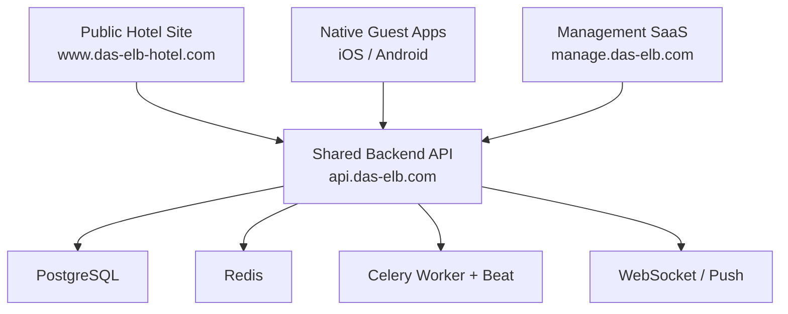

# Production Architecture

## Purpose

This document defines the target production deployment shape for the repository as it evolves from the current checked-in state.

It is based on the current codebase and deployment files, but it defines the intended final production model rather than the current partially implemented deployment.

## Final Deployment Shape

The platform remains a shared-system architecture:

- one shared backend API
- one shared PostgreSQL database
- one shared Redis/Celery runtime for asynchronous and realtime behavior
- multiple client surfaces with different domains and auth strategies

The final client surfaces are:

1. Public hotel landing site on the main hotel domain
2. Native restaurant guest apps for Android and iOS
3. A separate management SaaS domain for hotel and gastronomy staff

The backend and database remain the system of record for all domains.

## Phase Alignment

This final architecture must still respect the repository's current phased rollout decision:

- Phase 1:
  - backend for restaurant flows only
  - management SaaS for restaurant features
  - guest ordering via `das-elb-rest`
- Phase 2:
  - landing page rebuild for `das-elb-hotel`
  - hotel/HMS stabilization
- Phase 3:
  - native mobile apps
  - advanced analytics and integrations

Important rule:

- Hotel/HMS features are not considered production-ready in Phase 1 unless explicitly verified.

## Domain Mapping

### Recommended production domains

| Surface | Domain | Purpose | Current repo mapping |
| --- | --- | --- | --- |
| Public hotel / landing | `https://www.das-elb-hotel.com` | marketing site, hotel information, public booking-facing experience | `das-elb-hotel/` |
| Shared backend API | `https://api.das-elb.com` | single system-of-record API for all clients | `backend/` |
| Management SaaS | `https://manage.das-elb.com` | hotel + gastronomy operations and admin | `frontend/` |
| Native mobile apps | no public website domain | guest ordering experience for iOS/Android | future replacement for `das-elb-rest/` |
| Optional public asset CDN | `https://cdn.das-elb.com` | static media only, no business logic | not yet present in repo |

### Domain principles

- The hotel landing site stays on the hotel main domain.
- The management SaaS must not be served from the hotel public domain.
- The API should remain on a neutral backend hostname.
- Mobile clients must talk directly to the shared API, not to a separate mobile-only backend.

## API Base URLs

### Canonical base URLs

| Client | Base URL | Notes |
| --- | --- | --- |
| Hotel public site | `https://api.das-elb.com/api` | public routes only for public features |
| Management SaaS | `https://api.das-elb.com/api` | full authenticated admin API |
| Native iOS app | `https://api.das-elb.com/api` | guest-facing public/mobile-safe APIs |
| Native Android app | `https://api.das-elb.com/api` | guest-facing public/mobile-safe APIs |
| WebSocket base | `wss://api.das-elb.com/ws` | realtime for admin and operational clients |

### Endpoint families

| Endpoint family | Intended clients | Access |
| --- | --- | --- |
| `/api/auth/*` | management SaaS, future staff apps | authenticated or auth bootstrap |
| `/api/public/restaurant/*` | guest mobile app | public or guest-session based |
| `/api/public/hotel/*` | public hotel site | public |
| `/api/menu`, `/api/reservations`, `/api/billing`, `/api/inventory`, `/api/dashboard`, `/api/hms` | management SaaS | authenticated |
| `/ws/{tenant_or_scope}` | management SaaS and operational clients | authenticated websocket |

### API shape recommendations

- Public web and native guest flows should use explicit public/mobile-safe endpoint groups.
- Admin features should remain under authenticated `/api/*` routes.
- The backend should avoid separate “mini backends” per client; client differences should be handled by auth scope and route namespace, not by duplicate business logic.

## CORS Policy

### Target policy

The backend should allow only the production origins that actually need browser access.

Recommended browser CORS allowlist:

- `https://www.das-elb-hotel.com`
- `https://manage.das-elb.com`
- staging equivalents only in staging
- localhost/dev origins only in development

Native mobile apps are not governed by browser CORS in the same way, so they should not drive the browser allowlist design.

### Production CORS rules

- `Access-Control-Allow-Origin` must be explicit, never wildcard.
- `Allow-Credentials` should be enabled only for the management SaaS if cookie auth is used there.
- Public hotel routes should allow the hotel site origin.
- Admin routes should allow only the management SaaS origin.
- Staging and development origins must not remain enabled in production unless intentionally required.

### Required backend policy shape

- `backend/app/config.py` should define environment-specific `CORS_ORIGINS`.
- `backend/app/main.py` should continue to read those origins centrally.
- Production CORS must not include historical temporary domains such as current Render/Replit previews once the custom domains are live.

## Scaling and Failure Model

The system must tolerate partial failures and horizontal scaling.

### Backend

- Backend must be stateless and horizontally scalable.
- No in-memory state may be required for correctness.
- Multiple backend instances must be able to serve requests safely.
- Tenant resolution, auth validation, websocket authorization, and public flow correctness must work the same regardless of which backend instance handles the request.

### PostgreSQL

- PostgreSQL is the single source of truth.
- Backups must be enabled.
- Connection pooling must be used in production.
- Long-running queries must be avoided.
- Any cache, queue, or websocket outage must not compromise database correctness.

### Redis

- Redis is used for:
  - caching
  - Celery broker
  - websocket pub/sub
- Redis failure must not corrupt core data.
- Redis reconnect and retry behavior must be configured.
- Redis should accelerate delivery and coordination, but database-backed state must remain authoritative.

### Celery

- Tasks must be idempotent where possible.
- Failed tasks must retry safely.
- Critical tasks must be observable and logged.
- Task handlers must assume retries, duplicate delivery, and worker restarts are possible.

### WebSockets

- WebSocket connections must not rely on a single backend instance.
- Use Redis pub/sub for cross-instance event delivery.
- Clients must be able to reconnect safely.
- Reconnects must not create duplicate state transitions or bypass auth and tenant checks.

## Rate Limiting and Abuse Protection

Public endpoints must be protected against abuse.

- Apply rate limiting to:
  - booking endpoints
  - public ordering endpoints
  - authentication endpoints
- Use IP-based and tenant-aware limits where appropriate.
- Reject excessive requests with proper HTTP status codes.
- Do not allow unbounded public mutation endpoints.
- Guest flows such as QR ordering and booking must balance usability with abuse protection.

Operational rule:

- Public mutation routes must be treated as internet-exposed entry points by default, even when they look “low risk” from a product perspective.

## Observability and Monitoring

The system must be observable in production.

### Logging

- All backend requests should be logged.
- Errors must include context such as tenant, endpoint, and user if applicable.
- Background-task failures and websocket authorization failures must be logged with enough context for incident response.

### Metrics

Track:

- API request rate and latency
- error rates
- booking and ordering volume
- websocket connections
- Celery task success and failure

### Alerts

- Trigger alerts on:
  - high error rates
  - failed background jobs
  - database connectivity issues
  - Redis failures

### Health Checks

- Backend must expose health and readiness endpoints.
- These must be used by the deployment platform such as Render.
- Health checks should distinguish between basic liveness and dependency readiness where possible.

## Cookie vs Token Strategy

## Recommended split

Use different auth transport strategies for web admin vs native mobile.

### Management SaaS

Use secure HTTP-only cookies for browser authentication.

Recommended cookies:

- short-lived access cookie
- longer-lived refresh cookie

Cookie properties:

- `HttpOnly`
- `Secure`
- `SameSite=Lax`
- cookie domain scoped for `manage.das-elb.com` and `api.das-elb.com` compatibility

Why:

- removes bearer tokens from `localStorage`
- reduces token exfiltration risk from XSS
- fits browser-first management workflows better

### Native iOS / Android apps

Use bearer tokens, not cookies.

Recommended strategy:

- short-lived access token
- refresh token
- store in secure OS storage:
  - iOS Keychain
  - Android Keystore / encrypted storage

Why:

- mobile apps do not benefit from browser cookie semantics
- explicit token transport is simpler and more portable for native clients

### Public hotel site

Keep the public hotel site unauthenticated for public browsing flows.

If guest booking history or guest self-service is introduced later:

- use tokenized magic links or short-lived one-time guest session tokens
- do not reuse staff/admin auth flows

## Auth Flow

### Web management SaaS auth flow

1. User visits `https://manage.das-elb.com`
2. User submits credentials to `POST https://api.das-elb.com/api/auth/login`
3. Backend validates credentials and tenant membership
4. Backend issues secure HTTP-only cookies
5. Frontend calls `GET /api/auth/me` to hydrate current session
6. All subsequent API requests use cookies automatically
7. Refresh happens through refresh-cookie-based flow, not `localStorage`

### Native mobile guest auth/session flow

Phase 3 target:

1. App launches
2. Guest selects property/restaurant context or receives it from QR deep link/app config
3. App uses public/mobile-safe APIs for menu, ordering, and status
4. If guest identity is needed, app uses guest token or session token, not staff login
5. Tokens are stored in secure OS storage
6. Refresh uses explicit token refresh endpoint

### Staff auth vs guest auth

- Staff auth is for the management SaaS only.
- Guest mobile auth must be a separate concept from staff JWTs.
- Public hotel browsing remains unauthenticated.

## Tenant Isolation Rules

Tenant isolation must remain a non-negotiable system rule because backend and database stay shared.

### Current repository reality

- Restaurant tenancy already exists conceptually via `restaurant_id`.
- HMS/property scoping is weaker and less consistent in the current codebase.
- Several public adapters still hardcode `restaurant_id=1`, which is not acceptable for final production.

### Final tenant isolation rules

1. Every authenticated request must resolve to exactly one tenant context.
2. Restaurant data must always be scoped by `restaurant_id`.
3. Hotel data must always be scoped by `property_id`.
4. Shared identities such as users and guests may span domains only through backend-controlled relationships.
5. Public web and mobile flows must resolve tenant/property from:
   - domain
   - explicit property slug
   - signed app configuration
   - QR/deep-link metadata
   - never from hardcoded defaults

### Public tenant resolution rules

| Surface | Tenant resolution source |
| --- | --- |
| Hotel public site | resolve hotel property from domain or site configuration |
| Native guest app | resolve restaurant from app config, QR deep link, or environment |
| Management SaaS | resolve tenant from authenticated staff user context |

### Shared database rule

Because PostgreSQL remains shared:

- no client may bypass the backend for data decisions
- no frontend may assume tenant IDs
- cross-domain lookups must go through backend services

## Public vs Login-Protected Surface

### Public

These remain public:

- hotel landing pages and content
- hotel public availability and booking endpoints
- restaurant guest menu browsing and guest ordering endpoints
- QR/deep-link driven guest order status
- tokenized digital receipt or guest self-service links where explicitly designed
- digital signage display endpoints if intended for kiosk/public display

### Requires login

These must require authentication:

- management SaaS
- restaurant operations
- billing and payment administration
- reservations management
- inventory, workforce, accounting, dashboard, marketing, signage admin
- all hotel/HMS staff workflows
- metrics, agent, and operational control endpoints

### Must not be public

- websocket channels carrying internal operational data
- staff/admin management routes
- metrics and observability dashboards
- integration control endpoints
- any tenant-scoped mutation endpoint outside explicit public guest flows

## Final Client Responsibilities

### `das-elb-hotel` final role

- stays on the hotel main domain
- becomes the public hotel/landing site only
- should not carry management SaaS responsibilities
- should call only public hotel and landing-safe backend endpoints

### `frontend` final role

- becomes the management SaaS only
- hosted on a separate domain
- serves both gastronomy and hotel staff workflows
- should not host guest-ordering product UI long-term

### `das-elb-rest` final role

- transitional guest ordering client during Phase 1
- later replaced by native Android/iOS apps
- backend contracts used here must become the mobile contract basis

## Exact Code Changes Needed Next

This section lists the next code changes required to move the current repository toward the target production architecture. These are not yet implemented here.

### 1. Remove hardcoded production and localhost API assumptions

Files to change:

- `das-elb-rest/src/lib/api.js`
- compiled/public hotel API references currently embedded in `das-elb-hotel/public/_next/static/*`
- any remaining hardcoded API fallbacks in `frontend/src/app/*` and `frontend/src/lib/*`

What to change:

- eliminate fallback production URLs such as `https://gestronomy-api.onrender.com`
- standardize on environment-driven API base configuration
- ensure the public hotel site, management SaaS, and guest app each read the correct domain-specific API base

### 2. Move management SaaS web auth from localStorage bearer tokens to secure cookies

Files to change:

- `frontend/src/lib/api.ts`
- `frontend/src/lib/auth.ts`
- `frontend/src/stores/auth-store.ts`
- `frontend/src/app/(dashboard)/layout.tsx`
- `frontend/src/app/(management)/layout.tsx`
- `backend/app/auth/router.py`
- `backend/app/auth/service.py`
- potentially `backend/app/auth/utils.py` and auth response schemas

What to change:

- backend login should set secure HTTP-only cookies
- frontend should stop reading access tokens from `localStorage`
- session hydration should come from `/api/auth/me`
- refresh flow should become cookie-based for web

### 3. Keep native/mobile guest auth token-based and design the mobile-safe contract now

Files to change next:

- `backend/app/reservations/public_router.py`
- `backend/app/qr_ordering/router.py`
- `backend/app/qr_ordering/service.py`
- future mobile client package once created

What to change:

- normalize guest/public restaurant routes into a stable contract that is mobile-friendly
- ensure endpoints are stateless and do not depend on browser-only behavior
- introduce guest session or guest token semantics where needed

### 4. Add authenticated websocket handling

Files to change:

- `backend/app/websockets/router.py`
- `backend/app/websockets/connection_manager.py`
- `frontend/src/lib/websocket.ts`

What to change:

- validate auth on websocket connect
- reject unauthorized tenant subscriptions
- define separate websocket behavior for admin clients versus public guest flows

### 5. Fix tenant/property resolution for public surfaces

Files to change:

- `backend/app/landing_adapter.py`
- `backend/app/integrations/mcp_server.py`
- `backend/app/hms/public_router.py`
- likely add a shared tenant-resolution helper under `backend/app/shared/`

What to change:

- remove `restaurant_id=1` assumptions
- resolve hotel property from the landing-site domain/config
- resolve restaurant context from QR/app/deep-link configuration
- centralize public tenant resolution logic

### 6. Fix HMS contract drift before Phase 2

Files to change:

- `backend/app/hms/models.py`
- `backend/app/hms/public_router.py`
- `backend/app/hms/router.py`
- HMS pages under `frontend/src/app/(management)/hms/*`

What to change:

- align ORM fields with request/response payloads
- remove fallback/mock assumptions where routes are meant to be real
- add tests for booking, reservations, arrivals, departures, and room status

### 7. Cleanly separate deploy targets

Files to change:

- `frontend/Dockerfile`
- `frontend/next.config.ts`
- `frontend/package.json`
- `frontend/playwright.config.ts`
- `das-elb-hotel/Dockerfile`
- `das-elb-hotel/package.json`
- `das-elb-rest/Dockerfile`
- `das-elb-rest/package.json`
- `docker-compose.yml`
- `docker-compose.prod.yml`
- `render.yaml`

What to change:

- make each app’s build output match its Dockerfile
- align port usage and runtime expectations
- ensure Render and Docker agree on the deploy targets
- decide whether `das-elb-rest` is source-built or static and remove the conflicting path

### 8. Rebuild `das-elb-hotel` from maintainable source

Files/folders to replace or introduce:

- replace artifact-only flow in `das-elb-hotel/public/_next/static/*`
- add real source tree for the hotel site, or migrate it into a maintained frontend app package

What to change:

- stop patching compiled bundles as the long-term operating model
- keep the hotel site on its main domain, but restore source ownership

### 9. Expand public and critical-flow test coverage

Files to add next:

- backend tests for:
  - public hotel booking
  - public restaurant ordering
  - landing page submission flows
  - websocket auth
  - billing receipt token behavior
- frontend tests for:
  - management login/session behavior
  - critical restaurant SaaS flows
  - public guest ordering flows during Phase 1

### 10. Align environment and secrets configuration with the final architecture

Files to change:

- `.env.example`
- `backend/app/config.py`
- `render.yaml`
- deployment docs under `docs/` and root markdown docs

What to change:

- document final domains
- document cookie/session settings for management SaaS
- add missing production secrets such as Stripe webhook secret and integration secrets
- remove obsolete environment assumptions from old docs/scripts

## Recommended Implementation Order

### Immediate

1. standardize domains and API base configuration
2. fix deploy-target build drift
3. remove hardcoded tenant defaults
4. add websocket auth

### Before public Phase 1 launch

5. stabilize restaurant guest API contract for `das-elb-rest`
6. switch management SaaS to cookie auth
7. add tests for restaurant critical flows

### Before Phase 2

8. rebuild `das-elb-hotel` from maintainable source
9. stabilize HMS routes and pages
10. add hotel booking and reservation test coverage

### Before Phase 3

11. define native mobile guest auth/session design
12. add mobile-oriented endpoint and deep-link contract support

## Final Rule Set

- The backend and PostgreSQL database remain the shared system of record.
- The landing page remains on the hotel main domain.
- The restaurant guest experience moves to native mobile clients over time.
- The management SaaS runs on a separate domain from the public site.
- Browser admin auth uses secure cookies.
- Native mobile auth uses secure token storage.
- Tenant and property isolation must be resolved by backend logic, never by client assumptions.
- Public routes stay stable and intentional.
- Admin routes, metrics, websocket ops data, and internal mutation flows always require login.
